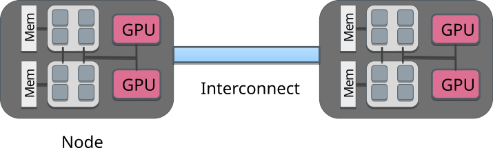
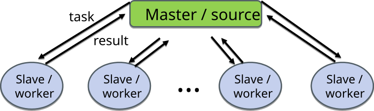
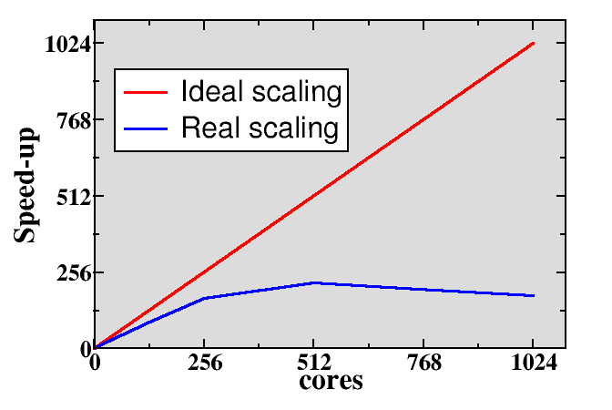
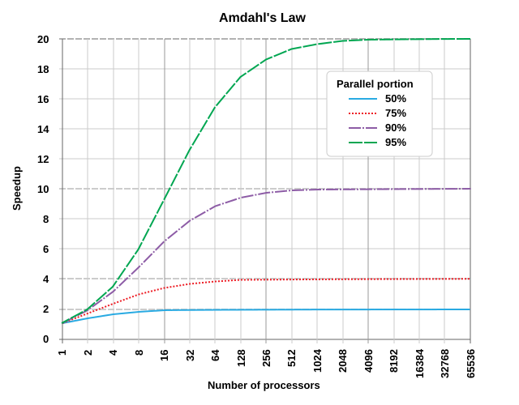
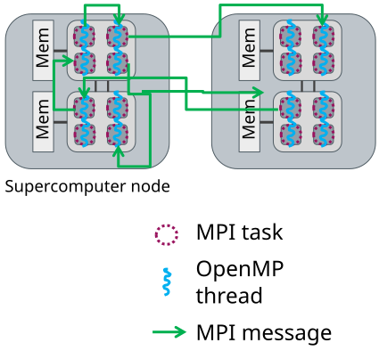
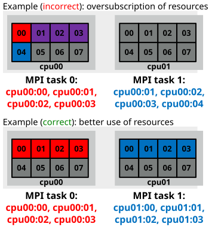

# Parallel computing concepts {.section}

# Anatomy of supercomputer

- Supercomputers consist of nodes connected with high-speed network
    - Latency `~`1 µs, bandwidth `~`200 Gb / s
- A node can contain several multicore CPUS
- Additionally, nodes can contain one or more accelerators
- Memory within the node is directly usable by all CPU cores

{.center width=60%}

# LUMI autopsy

{.center width=50%}

# Computing in parallel

- Parallel computing
    - A problem is split into smaller subtasks
    - Multiple subtasks are processed simultaneously using multiple cores/GPUs

<br>
<div class=column>
<!-- Copyright CSC -->
 {.center width=80%}
</div>
<div class=column>
{.center width=90%}
</div>

# Types of parallel problems

- Tightly coupled
    - Lots of interaction between subtasks
    - Weather simulation
    - Low latency, high speed interconnect is essential
- Embarrassingly parallel
    - Very little (or no) interaction between subtasks
    - Sequence alignment queries for multiple independent sequences in bioinformatics


# Exposing parallelism

<div class=column>
- Data parallelism
    - Data is distributed across cores
    - Each core performs simultaneously (nearly) identical operations with different data
    - Cores may need to interact with each other, e.g. exchange information about data on domain boundaries
</div>
<div class=column>

<!-- Copyright CSC -->
 {.center width=80%}

</div>

# Exposing parallelism

- Task farm (master / worker)

<!-- Copyright CSC -->
 {.center width=60%}

<br>

- Master sends tasks to workers and receives results
- There are normally more tasks than workers, and tasks are assigned dynamically

# Parallel scaling

<div class=column>
- Strong parallel scaling
    - Constant problem size
    - Execution time decreases in proportion to the increase in the number of cores
- Weak parallel scaling
    - Increasing problem size
    - Execution time remains constant when number of cores increases in proportion to the problem size
</div>
<div class=column>

<!-- Copyright CSC -->
 {.center width=80%}

</div>

# What limits parallel scaling

<div class=column style=width:60%>
- Load imbalance
    - Variation in workload over different execution units
- Parallel overheads
    - Additional operations which are not present in serial calculation
    - Synchronization, redundant computations, communications
- Amdahl’s law: the fraction of non-parallelizable parts limits maximum speedup
</div>
<div class=column style=width:38%>
  {.center width=100%}
</div>


# Parallel programming {.section}

# Parallel programming models

- Parallel execution is based on threads or processes (or both) which run at the same time on different CPU cores
- Processes - MPI (Message passing interface)
    - Independent execution units
    - Have their own state information and *own memory* address space
    - Interaction is based on exchanging messages between processes
- Threads - OpenMP, pthreads
    - Have their own state information, but *share* the *same memory*
  address space
    - Interaction is based on shared memory, i.e. each thread can access directly other threads data

# Parallel programming models

<!-- Copyright CSC -->
 {.center width=80%}
<div class=column>
**MPI: Processes**

- MPI launches N processes at application startup
- Processes communicate by exchanging messages
- Works over multiple nodes
</div>
<div class=column>

**OpenMP: Threads**

- Threads share memory space
- Threads are created and destroyed  (parallel regions)
- Limited to a single node

</div>

# GPU programming models

- GPUs are co-processors to the CPU
- CPU controls the work flow:
  - *offloads* computations to GPU by launching *kernels*
  - allocates and deallocates the memory on GPUs
  - handles the data transfers between CPU and GPUs
- GPU kernels run multiple threads
    - Typically much more threads than "GPU cores"
- When using multiple GPUs, CPU runs typically multiple processes (MPI) or multiple threads (OpenMP)

# GPU programming models

{.center width=40%}
<br>

- CPU launches kernel on GPU
- Kernel execution is normally asynchronous
    - CPU remains active
- Multiple kernels may run concurrently on same GPU

# Execution model in MPI

- Normally, parallel program is launched as a set of *independent*, *identical
  processes*
    - execute the *same program code* and instructions
    - processes can reside in different nodes (or even in different computers)
- The way to launch parallel program depends on the computing system
    - **`mpiexec`**, **`mpirun`**, **`srun`**, **`aprun`**, ...
    - **`srun`** on LUMI, Mahti, and Puhti

# Compiling an MPI program

- MPI is a library (+ runtime system)
- In principle, MPI programs can be built with standard compilers
  (`gcc` / `g++` / `gfortran`) with the appropriate `-I` / `-L` / `-l`
  options
- Most MPI implementations provide convenience wrappers, typically
  `mpicc` / `mpicxx` / `mpif90`, for easier building
    - MPI-related options are automatically included

```bash
mpicc -o my_mpi_prog my_mpi_code.c
mpicxx -o my_mpi_prog my_mpi_code.cpp
mpif90 -o my_mpi_prog my_mpi_code.F90
```

# Compiling an MPI program on LUMI

- On LUMI (HPE Cray EX), there are `cc` / `CC` / `ftn` compiler wrappers
  invoking the correct compiler
  - use these instead of the `mpi*` wrappers

```bash
cc -o my_mpi_prog my_mpi_code.c
CC -o my_mpi_prog my_mpi_code.cpp
ftn -o my_mpi_prog my_mpi_code.F90
```

# Running an MPI program

- On a laptop or workstation MPI program can be started from the command line with the
`mpiexec` launcher:
```
$ mpiexec -n 4 ./myprog
```
- On a supercomputer, one should use the batch queuing system. The **launcher** command 
  depends on the queuing system, in Slurm the command is `srun`

# Hybrid programming: Launch threads (OpenMP) *within* processes (MPI)

<div class="column">
  - Shared memory programming inside a node, message passing between
    nodes
  - Matches well modern supercomputer hardware
  - Optimum MPI task per node ratio depends on the application and should always be experimented.
</div>

<div class="column">
{.center width=80%}
</div>

# Running parallel programs

- Most parallel programs are written to work with arbitrary number of
  processes / threads / GPUs
- Number of processes / threads / GPUs is specified when launching the
  program
    - Number of threads within GPU is typically given inside the
      program
- Number of processes: specific launch command (`srun`)
- Number of threads: environment variables (`OMP_NUM_THREADS`)

# Thread and process affinity {.section}

# Thread and process affinity 

- Normally, operating system can run threads and processes in any
  logical core
- Operating system may even move running task from one core to another
    - Can be beneficial for load balancing
    - For HPC workloads often detrimental as private caches get
      invalidated and NUMA locality is lost
- User can control where tasks are run via affinity masks
    - Task can be *pinned* to a specific logical core or set of logical cores

# Controlling affinity

- Affinity for a *process* can be set with a `numactl` command
    - Limit the process to logical cores 0,3,7:
      <br>
      `numactl --physcpubind=0,3,7 ./my_exe`
    - Threads "inherit" the affinity of their parent process
- Affinity of a thread can be set with OpenMP environment variables
    - `OMP_PLACES=[threads,cores,sockets]`
    - `OMP_PROC_BIND=[true, close, spread, master]`
- OpenMP runtime prints the affinity with `OMP_DISPLAY_AFFINITY=true`

# Controlling affinity

```
export OMP_AFFINITY_FORMAT="Thread %0.3n affinity %A"
export OMP_DISPLAY_AFFINITY=true
./test
Thread 000 affinity 0-7
Thread 001 affinity 0-7
Thread 002 affinity 0-7
Thread 003 affinity 0-7
```

```
OMP_PLACES=cores ./test
Thread 000 affinity 0,4
Thread 001 affinity 1,5
Thread 002 affinity 2,6
Thread 003 affinity 3,7
```

# MPI+OpenMP thread affinity

<div class="column">
- MPI library must be aware of the underlying OpenMP for correct
  allocation of resources
    - Oversubscription of CPU cores may cause significant performance
      penalty
- Additional complexity from batch job schedulers
- Heavily dependent on the platform used!
</div>

<div class="column">
{.center width=70%}
</div>

# Slurm configuration at CSC

- Within a node, `--tasks-per-node` MPI tasks are spread
  `--cpus-per-task` apart
- Threads within a MPI tasks have the affinity mask for the
  corresponging
  <br>
  `--cpus-per-task` cores
```
export OMP_AFFINITY_FORMAT="Process %P thread %0.3n affinity %A"
export OMP_DISPLAY_AFFINITY=true
srun ... --tasks-per-node=2 --cpus-per-task=4 ./test
Process 250545 thread 000 affinity 0-3
...
Process 250546 thread 000 affinity 4-7
...
```

- Slurm configurations in other HPC centers can be very different
    - Always experiment before production calculations!

# Summary

- Performance of HPC applications is often improved when processes and
threads are pinned to CPU cores
- MPI and batch system configurations may affect the affinity
    - very system dependent, try to always investigate

