# Message Passing Interface (MPI)

- MPI is an application programming interface (API) for distributed parallel computing
- MPI programs are portable and scalable
    - the same program can run on different types of computers, from
      laptops to supercomputers
- MPI is flexible and comprehensive
    - large (hundreds of procedures)
    - concise (only 10-20 procedures are typically needed)


# Processes and threads

{.center width=85%}

<div class="column">

**Process**

- Independent execution units
- Have their own state information and *own memory* address space

</div>

<div class="column">

**Thread**

- A single process may contain multiple threads
- Have their own state information, but *share* the *same memory*
  address space

</div>


# Execution model in MPI

- Normally, parallel program is launched as a set of *independent*, *identical
  processes*
    - execute the *same program code* and instructions
    - processes can reside in different nodes (or even in different computers)
- The way to launch parallel program depends on the computing system
    - **`mpiexec`**, **`mpirun`**, **`srun`**, **`aprun`**, ...
    - **`srun`** on LUMI, Mahti, and Puhti
- MPI supports also dynamic spawning of processes and launching *different*
  programs communicating with each other
    - not covered here

# MPI ranks

<div class="column">
- MPI runtime assigns each process a unique rank (index)
    - identification of the processes
    - ranks range from 0 to N-1
- Processes can perform different tasks and handle different data based
  on their rank
</div>
<div class="column">
```c
double a;
if (rank == 0) {
   a = 1.0;
   ...
}
else if (rank == 1) {
   a = 0.7;
   ...
}
...
```
</div>

# Data model

- All variables and data structures are local to the process
- Processes can exchange data by sending and receiving messages

{.center width=100%}


# MPI library

- Information about the communication framework
    - the number of processes
    - the rank of the process
- Communication between processes
    - sending and receiving messages between two or several processes
- Synchronization between processes
- Advanced features
    - Communicator manipulation, user defined datatypes, one-sided communication, ...


# MPI communicator

- Communicator is an object connecting a group of processes
    - It defines the communication framework
- Most MPI functions require a communicator as an argument
- Initially, there is always a communicator **`MPI_COMM_WORLD`** which contains all the processes
- Users can define custom communicators


# Interlude

Message passing game


# Programming MPI

- The MPI standard defines interfaces to C and Fortran programming languages
    - No C++ bindings in the standard, C++ programs use the C interface
    - There are unofficial bindings to Python, Rust, R, ...
- Call convention in C (*case sensitive*):<br>
`error_code = MPI_Xxxx(parameter, ...)`
    - Return value is the error code (e.g., `MPI_SUCCESS`)
    - Some arguments have to be passed as pointers
- Call convention in Fortran (*case insensitive*):<br>
`call mpi_xxxx(parameter, ..., error_code)`
    - Error code in the last argument


# Writing an MPI program

## C/C++:

```c
// Include MPI header file
#include <mpi.h>

int main(int argc, char *argv[])
{
    // Start by calling MPI_Init()
    MPI_Init(&argc, &argv);

    ...  // program code

    // Call MPI_Finalize() before exiting
    MPI_Finalize();
}


```

# Compiling an MPI program

- MPI is a library (+ runtime system)
- In principle, MPI programs can be built with standard compilers
  (`gcc` / `g++` / `gfortran`) with the appropriate `-I` / `-L` / `-l`
  options
- Most MPI implementations provide convenience wrappers, typically
  `mpicc` / `mpicxx` / `mpif90`, for easier building
    - MPI-related options are automatically included

```bash
mpicc -o my_mpi_prog my_mpi_code.c
mpicxx -o my_mpi_prog my_mpi_code.cpp
mpif90 -o my_mpi_prog my_mpi_code.F90
```

# Compiling an MPI program on LUMI

- On LUMI (HPE Cray EX), there are `cc` / `CC` / `ftn` compiler wrappers
  invoking the correct compiler
  - Use these instead of the `mpi*` wrappers

```bash
cc -o my_mpi_prog my_mpi_code.c
CC -o my_mpi_prog my_mpi_code.cpp
ftn -o my_mpi_prog my_mpi_code.F90
```

# MPI functions

- Syntax on slides: **`MPI_Function(` `input_arg`{.input} `, ` `output_arg`{.output} `)`**
  - Input arguments in `red`{.input} and output arguments in `blue`{.output}
- Note that in C the output arguments are always pointers!
- See references of MPI implementations for detailed function definitions:
  - <https://docs.open-mpi.org/en/v5.0.x/man-openmpi/man3/index.html>
  - <https://www.mpich.org/static/docs/v4.2.x/>
  - `man MPI_Function` on LUMI (e.g., `man MPI_Init`)


# First five MPI commands: Initialization and finalization

MPI_Init(...)
  : Initializes the MPI execution environment

MPI_Finalize()
  : Terminates the MPI execution environment


# First five MPI commands: Information about the communicator

MPI_Comm_size(`comm`{.input}, `size`{.output})
  : Determines the size of the group associated with a communicator

MPI_Comm_rank(`comm`{.input}, `rank`{.output})
  : Determines the rank of the calling process in the communicator


# First five MPI commands: Synchronization

MPI_Barrier(`comm`{.input})
  : Waits until all ranks within the communicator reaches the call


# Point-to-point communication {.section}

# Communication in MPI

<div class="column">

- Data is local to the MPI processes
    - They need to *communicate* to coordinate work
- Point-to-point communication
    - Messages are sent between two processes
- Collective communication
    - Involving a number of processes at the same time

</div>

<div class="column">

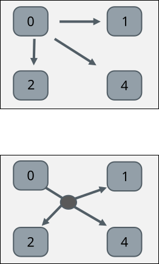{.center width=50%}

</div>


# MPI point-to-point operations

- One process *sends* a message to another process that *receives* it with **`MPI_Send`** and **`MPI_Recv`** routines
- Sends and receives in a program should match – one receive per send
- Each message (envelope) contains
    - The actual *data* (buffer) that is to be sent
    - The *number of elements* in the data
    - The *datatype* of each element of the data
    - The ranks of the *source* and *destination* processes
    - An identification number for the message (*tag*)


# MPI point-to-point operations

MPI_Send(`buffer`{.input}, `count`{.input}, `datatype`{.input}, `dest`{.input}, `tag`{.input}, `comm`{.input})
  : Performs a blocking send
  : Note: `count` parameter is the number of elements to send

MPI_Recv(`buffer`{.output}, `count`{.input}, `datatype`{.input}, `source`{.input}, `tag`{.input}, `comm`{.input}, `status`{.output})
  : Performs a blocking receive
  : Note: `count` parameter is the **maximum** number of elements to receive

<p>


# Status parameter

- The status parameter in `MPI_Recv` contains information about the received data after the call has completed
  - The number of received elements
    - Use the function **`MPI_Get_count`(`status`{.input}, `datatype`{.input}, `count`{.output})**
    - Note: `count` parameter of `MPI_Recv` is the **maximum** number of elements to receive
  - The tag of the received message
    - C: `status.MPI_TAG`
    - Fortran 2008: `status%mpi_tag` (old Fortran `status(MPI_TAG)`)
  - The rank of the sender
    - C: `status.MPI_SOURCE`
    - Fortran 2008: `status%mpi_source` (old Fortran `status(MPI_SOURCE)`)


# Buffers in MPI

- The `buffer` arguments are memory addresses
- MPI assumes contiguous chunk of memory
    - `count` elements are send starting from the address
    - received elements are stored starting from the address
- In C/C++ `buffer` is pointer
    - For C++ `<array>` and `<vector>` containers, use `array.data()` or `&array[i]`
- In Fortran arguments are passed by reference and variables can be passed as such to MPI calls
    - Note: be careful if passing non-contiguous array segmens such as <br>`a(1, 1:N)`


# MPI datatypes

- On a low level, MPI sends and receives stream of bytes
- MPI datatypes specify how the bytes should be interpreted
    - Allows data conversions in heterogenous environments (*e.g.* little endian to big endian)
- MPI has a number of predefined basic datatypes corresponding to C or Fortran datatypes
    - Listed in the next slides
- Datatype `MPI_BYTE` for raw bytes is available both in C and Fortran
    - Portability can be an issue when using `MPI_BYTE` - be careful
- One can also define custom datatypes for communicating complex data


# Common MPI datatypes specific for C

| MPI type     |  C type       |
| ------------ | ------------- |
| `MPI_CHAR`   | `signed char` |
| `MPI_SHORT`  | `short int`   |
| `MPI_INT`    | `int`         |
| `MPI_LONG`   | `long int`    |
| `MPI_FLOAT`  | `float`       |
| `MPI_DOUBLE` | `double`      |


# Common MPI datatypes specific for Fortran

| MPI type               |  Fortran type    |
| ---------------------- | ---------------- |
| `MPI_CHARACTER`        | character        |
| `MPI_INTEGER`          | integer          |
| `MPI_REAL`             | real32           |
| `MPI_DOUBLE_PRECISION` | real64           |
| `MPI_COMPLEX`          | complex          |
| `MPI_DOUBLE_COMPLEX`   | double complex   |
| `MPI_LOGICAL`          | logical          |


# Case study: parallel sum on two processes

<div class=column>
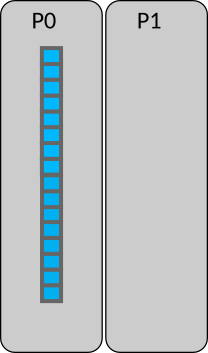{.center width=45%}
</div>
<div class=column>
- Array initially on process #0 (P0)
- Parallel algorithm:
    1. **Scatter**:
    P0 sends half of the array to process P1

    2. **Compute**:
    P0 & P1 sum independently their segments

    3. **Reduction**:
    Partial sum on P1 is sent to P0 and
    P0 sums the partial sums

</div>

# Case study: parallel sum on two processes

<div class=column>
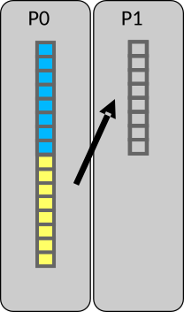{.center width=45%}
</div>
<div class=column>
**Step 1**: Scatter array
<p>
{.center width=90%}
</div>

# Case study: parallel sum on two processes

<div class=column>
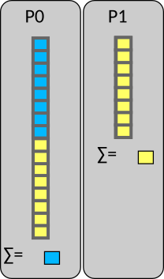{.center width=45%}
</div>
<div class=column>
**Step 2**: Compute the sum in parallel
<p>
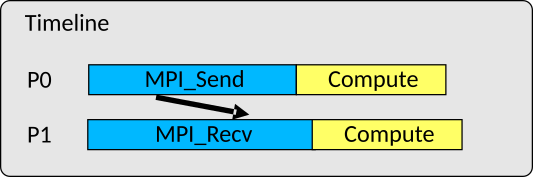{.center width=90%}
</div>

# Case study: parallel sum on two processes

<div class=column>
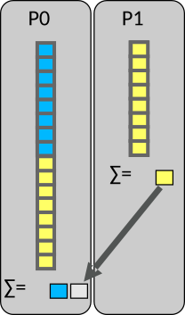{.center width=45%}
</div>
<div class=column>
**Step 3.1**: Gather partial sums
<p>
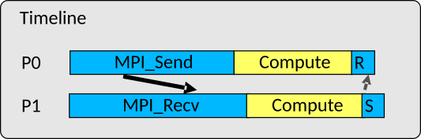{.center width=90%}
</div>

# Case study: parallel sum on two processes

<div class=column>
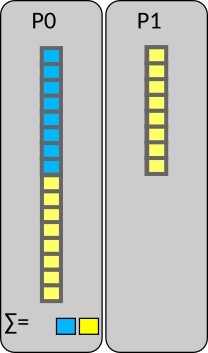{.center width=45%}
</div>
<div class=column>
**Step 3.2**: Compute the total sum
<p>
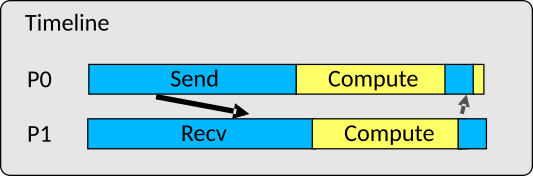{.center width=90%}
</div>


# Blocking routines and deadlocks

- `MPI_Send` and `MPI_Recv` are blocking routines
    - `MPI_Send` exits once the send buffer can be safely read and written to
    - `MPI_Recv` exits once it has received the message in the receive buffer
- Completion depends on other processes → risk for *deadlocks*
    - For example, all processes are waiting in `MPI_Recv` but no-one is sending <br>
      → the program is stuck forever (deadlock)

# Combined send & receive

MPI_Sendrecv(`sendbuf`{.input}, `sendcount`{.input}, `sendtype`{.input}, `dest`{.input}, `sendtag`{.input}, `recvbuf`{.output}, `recvcount`{.input}, `recvtype`{.input}, `source`{.input}, `recvtag`{.input}, `comm`{.input}, `status`{.output})
  : `-`{.ghost}

- Sends one message and receives another one, with a single command
    - Reduces risk for deadlocks and improves performance
- Destination rank and source rank can be same or different
- `MPI_PROC_NULL` can be used for coping with the boundaries
      

# Collective communication {.section}

# Collective communication

- Collective communication transmits data among all processes in a
  process group (communicator)
- Collective communication includes
    - data movement
    - collective computation
    - synchronization

# Collective communication

- Collective communication typically outperforms
  point-to-point communication
- Code becomes more compact and easier to read:

<div class=column>
```fortranfree
if (rank == 0) then
    do i = 1, ntasks-1
        call mpi_send(a, 1048576, &
            MPI_REAL, i, tag, &
            MPI_COMM_WORLD, rc)
    end do
else
    call mpi_recv(a, 1048576, &
        MPI_REAL, 0, tag, &
        MPI_COMM_WORLD, status, rc)
end if
```
</div>
<div class=column>
```fortranfree
call mpi_bcast(a, 1048576, &
               MPI_REAL, 0, &
               MPI_COMM_WORLD, rc)

```
Communicating a vector **a** consisting of 1M float elements from
the task 0 to all other tasks

</div>

# Introduction

- These routines **must be called by all the processes** in the communicator
- Amount of sent and received data must match
- No tag arguments
    - Order of execution must coincide across processes

# Broadcasting

- Replicate data from one process to all others

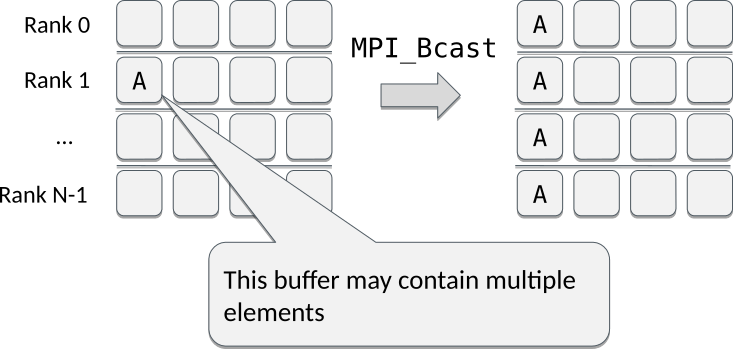{.center width=80%}

# Broadcasting

MPI_Bcast(`buf`{.input}`fer`{.output}, `count`{.input}, `datatype`{.input}, `root`{.input}, `comm`{.input})
: Broadcasts data from the root process to all other processes of the group


# Scattering

- Send data from one process to other processes

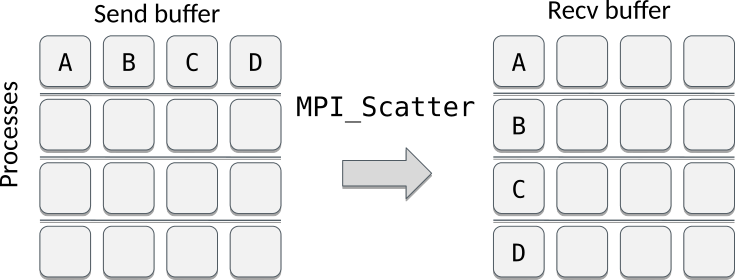{.center width=80%}

<p>
- Segments A, B, … may contain multiple elements

# Scattering data, example with data

- Example: Scattering elements from process `#`0 to all other processes with a recvcount of 2

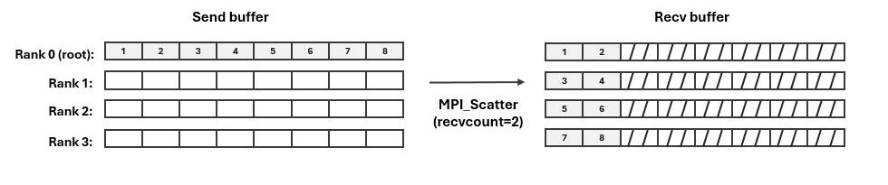{.center width=100%}

# Scattering

MPI_Scatter(`sendbuf`{.input}, `sendcount`{.input}, `sendtype`{.input}, `recvbuf`{.output}, `recvcount`{.input}, `recvtype`{.input}, `root`{.input}, `comm`{.input})
: Sends data from the root process to all other processes of the group

<p>
- Data is scattered in portions of equal size (`sendcount`)


# Examples

Assume 4 MPI tasks. What would the (full) program print?

<div class=column>
```fortranfree
if (rank==0) then
    do i = 1, 16
        a(i) = i
    end do
end if
call mpi_bcast(a, 16, MPI_INTEGER, 0, &
        MPI_COMM_WORLD, rc)
if (rank==3) print *, a(:)
```
<small>
 **A)** `1 2 3 4`<br>
 **B)** `13 14 15 16`<br>
 **C)** `1 2 3 4 5 6 7 8 9 10 11 12 13 14 15 16`
</small>

</div>
<div class=column>
```fortranfree
if (rank==0) then
    do i = 1, 16
        a(i) = i
    end do
end if
call mpi_scatter(a, 4, MPI_INTEGER, aloc, 4 &
    MPI_INTEGER, 0, MPI_COMM_WORLD, rc)
if (rank==3) print *, aloc(:)
```
<small>
 **A)** `1 2 3 4`<br>
 **B)** `13 14 15 16`<br>
 **C)** `1 2 3 4 5 6 7 8 9 10 11 12 13 14 15 16`
</small>

</div>

# Vector version of scatter

MPI_Scatterv(`sendbuf`{.input}, `sendcounts`{.input}, `displs`{.input}, `sendtype`{.input}, `recvbuf`{.output}, `recvcount`{.input}, `recvtype`{.input}, `root`{.input}, `comm`{.input})
: Sends data from the root process to all other processes of the group

<p>
- Data is scattered in portions given by `sendcounts` and `displs`

# Scattering data, example with data

- Example: Scattering elements from process `#`2 with different amounts of elements for each process

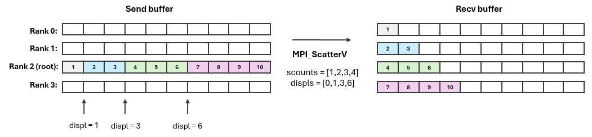{.center width=100%}

# Scatterv example

<div class=column>
```fortranfree
if (rank==0) then
  do i = 1, 10
    a(i) = i
  end do
end if

scounts(0:3) = [ 1, 2, 3, 4 ]
displs(0:3) = [ 0, 1, 3, 6 ]

call mpi_scatterv(a, scounts, &
    displs, MPI_INTEGER, &
    aloc, scounts(rank), &
    MPI_INTEGER, 0, &
    MPI_COMM_WORLD, rc)

```

</div>
<div class=column>
Assume 4 MPI tasks. What are the values in `aloc` in the last task (#3)?

<br>

**A)** `1 2 3`<br>
**B)** `7 8 9 10`<br>
**C)** `1 2 3 4 5 6 7 8 9 10`
</div>

# Gathering data

- Collect data from all the processes to one process

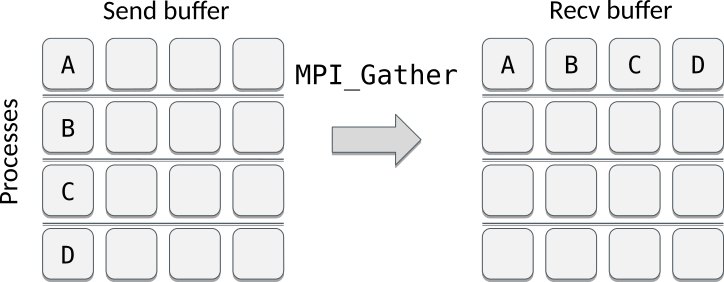{.center width=80%}

- Segments A, B, ... may contain multiple elements

# Gathering data, example with data

- Example: Gathering two elements from each process into process `#`0

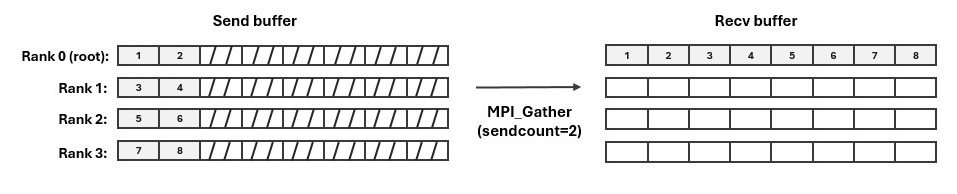{.center width=100%}

# Gathering data

MPI_Gather(`sendbuf`{.input}, `sendcount`{.input}, `sendtype`{.input}, `recvbuf`{.output}, `recvcount`{.input}, `recvtype`{.input}, `root`{.input}, `comm`{.input})
: Gathers data to the root process from all other processes of the group

<p>
- Data is gathered in portions of equal size (`recvcount`)

# Vector version of gather

MPI_Gatherv(`sendbuf`{.input}, `sendcount`{.input}, `sendtype`{.input}, `recvbuf`{.output}, `recvcounts`{.input}, `displs`{.input}, `recvtype`{.input}, `root`{.input}, `comm`{.input})
: Gathers data to the root process from all other processes of the group

<p>
- Data is gathered in portions given by `recvcounts` and `displs`

# Gathering data, vector example

- Example: Gathering different number of elements from each process into process `#`2

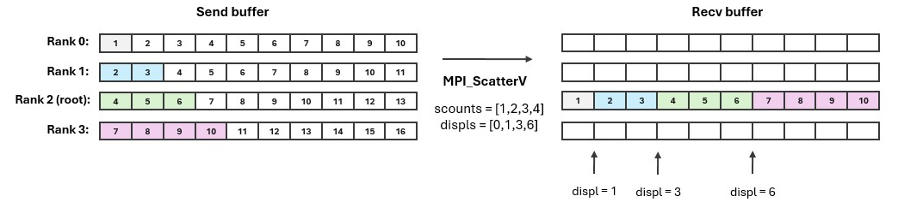{.center width=100%}

# All gather

- Collect data from all the processes and replicate the resulting data to all of them
    - Similar to `MPI_Gather` + `MPI_Bcast` but more efficient

<p>
{.center width=50%}


# All gather

MPI_Allgather(`sendbuf`{.input}, `sendcount`{.input}, `sendtype`{.input}, `recvbuf`{.output}, `recvcount`{.input}, `recvtype`{.input}, `comm`{.input})
: Gathers data from all processes and distributes it to all processes


# All to all

- Send a distinct message from every process to every processes
    - Kind of "All scatter" or "transpose" like operation

<p>
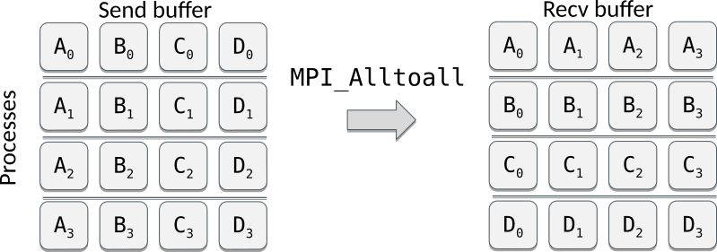{.center width=80%}

<p>


# All to all

MPI_Alltoall(`sendbuf`{.input}, `sendcount`{.input}, `sendtype`{.input}, `recvbuf`{.output},`recvcount`{.input}, `recvtype`{.input}, `comm`{.input})
: All processes send data to all processes


# All-to-all example

<div class=column>
```fortranfree
if (rank==0) then
  do i = 1, 16
    a(i) = i
  end do
end if
call mpi_bcast(a, 16, MPI_INTEGER, 0, &
    MPI_COMM_WORLD, rc)

call mpi_alltoall(a, 4, MPI_INTEGER, &
                  aloc, 4, MPI_INTEGER, &
                  MPI_COMM_WORLD, rc)
```
Assume 4 MPI tasks. What will be the values of **aloc in the process #0?**
</div>

<div class=column>
**A)** `1, 2, 3, 4`</br>
**B)** `1, ..., 16`</br>
**C)** `1, 2, 3, 4, 1, 2, 3, 4,`
`1, 2, 3, 4, 1, 2, 3, 4`
</div>

# Collective reductions {.section}

# Introduction

- Collective reduction operations allow performing computations on data distributed over all processes in a
  process group (communicator)


# Reduction operations

- Applies an operation to data scattered over processes and places the result in a single process

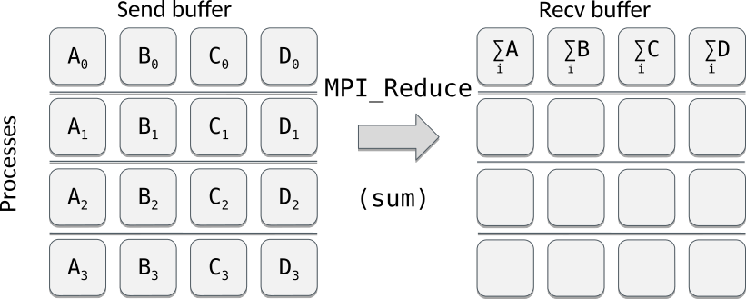{.center width=80%}

# Available reduction operations

<div class=column>
| Operation    | Meaning              |
|--------------|----------------------|
| `MPI_MAX`    | Max value            |
| `MPI_MIN`    | Min value            |
| `MPI_SUM`    | Sum                  |
| `MPI_PROD`   | Product              |
| `MPI_MAXLOC` | Max value + location |
| `MPI_MINLOC` | Min value + location |
</div>
<div class=column>
| Operation  | Meaning      |
|------------|--------------|
| `MPI_LAND` | Logical AND  |
| `MPI_BAND` | Bitwise AND  |
| `MPI_LOR`  | Logical OR   |
| `MPI_BOR`  | Bitwise OR   |
| `MPI_LXOR` | Logical XOR  |
| `MPI_BXOR` | Bitwise XOR  |
</div>


# Reduce operation

MPI_Reduce(`sendbuf`{.input}, `recvbuf`{.output}, `count`{.input}, `datatype`{.input}, `op`{.input}, `root`{.input}, `comm`{.input})
  : Combines values to the root process from all processes of the group

<p>
- Demo: `reduce.c`


# Global reduction

MPI_Allreduce(`sendbuf`{.input}, `recvbuf`{.output}, `count`{.input}, `datatype`{.input}, `op`{.input}, `comm`{.input})
  :  Combines values from all processes and distributes the result back to all processes

<p>
- Similar to `MPI_Reduce` + `MPI_Bcast` but more efficient

<p>
- Demo: `reduce.c`


# Allreduce example: parallel dot product

<div class=column>
```fortranfree
real :: a(1024), aloc(128)
...
if (rank==0) then
    call random_number(a)
end if
call mpi_scatter(a, 128, MPI_INTEGER, &
                 aloc, 128, MPI_INTEGER, &
                 0, MPI_COMM_WORLD, rc)
rloc = dot_product(aloc, aloc)
call mpi_allreduce(rloc, r, 1, MPI_REAL, &
                   MPI_SUM, MPI_COMM_WORLD, &
                   rc)
```
</div>
<div class=column>
```
> srun -n 8 ./mpi_pdot
 id= 6 local= 39.68326  global= 338.8004
 id= 7 local= 39.34439  global= 338.8004
 id= 1 local= 42.86630  global= 338.8004
 id= 3 local= 44.16300  global= 338.8004
 id= 5 local= 39.76367  global= 338.8004
 id= 0 local= 42.85532  global= 338.8004
 id= 2 local= 40.67361  global= 338.8004
 id= 4 local= 49.45086  global= 338.8004
```
</div>


# Common mistakes with collectives

1. Using a collective operation within if-rank test:<br>
`if (rank == 0) call mpi_bcast(...`
    - All the processes, both the root (the sender or the receiver) and
      the rest (receivers or senders), must call the collective routine!
2. Assuming that all processes making a collective call would complete at the same time


# Web resources

- List of MPI functions with detailed descriptions
    - <https://docs.open-mpi.org/en/v5.0.x/man-openmpi/man3/index.html>
    - <https://www.mpich.org/static/docs/v4.2.x/>
    - <https://rookiehpc.org/mpi/docs/>
- Good online MPI tutorials
    - <https://hpc-tutorials.llnl.gov/mpi/>
    - <http://mpitutorial.com/tutorials/>
    - <https://www.youtube.com/watch?v=BPSgXQ9aUXY>
- MPI coding game in C
    - <https://www.codingame.com/playgrounds/47058/have-fun-with-mpi-in-c/lets-start-to-have-fun-with-mpi>
