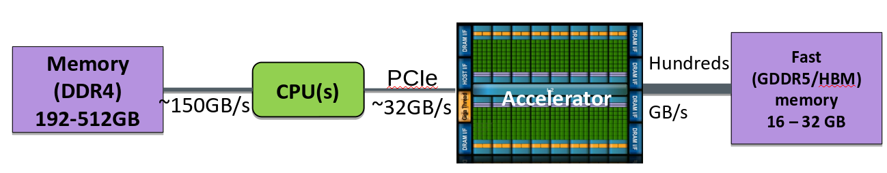

# Outline

- Basic C++ concepts
- Lambda functions
- Stdlib algorithms and parallelism
- GPU programming with stdlib

# Basic concepts

- Templates, classes
- `auto` variable declaration
- Containers in stdlib (`vector`, `array` `tuple`)
- Iterators, "algorithms"
- Raw pointers and references

# Lambda expressions

- Unnamed function objects that can capture variables in scope
- Syntax: `[ captures ] (parameters) -> return-type { body }`

```cpp
int a = 1, b = 2, c = 3;

// Capture `a` by value
auto func1 = [a](int x) { return a + x; };
c = func1(4);  // 5

a = -1;
c = func1(4);  // 5

// Capture to a new variable
auto func2 = [d = 2*a](int x) { return d + x; };
c = func2(4);  // 2

```

# Lambda expressions cont'd

```cpp
...

// This will fail; `b` not captured
auto func3 = [a](int x) { return b + x; };

// Capture everything by value
auto func3 = [=](int x) { return b + x; };
c = func3(4);  // 6

```

# Lambda expressions cont'd

```cpp
...

// Capture `b` by reference
auto func4 = [&b](int x) { return b + x; };
c = func4(4);  // 6

b = -2;
c = func4(4);  // 2

// Capture everything by reference
auto func5 = [&](int x) { a = x; b = -x; };
func5(4);  // a = 4, b = -4

```

# Lambda expressions cont'd

```cpp
...

// Mix and match
auto func6 = [=,&b](int x) { return a + b + x; };
c = func6(4);  // 4

a = b = 0;
c = func6(4);  // 8

```

# C++ Standard parallelism {.section}


# Introduction

- ''Traditional'' way of processing data:

```cpp
#include <vector>

double a = 5;
std::vector<double> x = {1, 2, 3, 4}, y(4);

for (int i = 0; i < 4; ++i) {
    y[i] = a * x[i];
}

```

# Introduction cont'd

- Separating computation and iteration:

```cpp
// Kernel: what to do for each data element
auto kernel = [=](const double x) {
    return a * x;
};

// Loop: how to process through all data
for (int i = 0; i < 4; ++i) {
    y[i] = kernel(x[i]);
}

```

# C++ algorithms library

- Algorithms abstract the looping part

```cpp
#include <algorithm>

auto kernel = [=](const double x) {
    return a * x;
};

// Process through all data
std::transform(begin(x), end(x), begin(y), kernel);

```

# Available C++ algorithms

- C++ standard library has algorithms for generic batch operation, reductions, searching, sorting, ...
  - [List of algorithms](https://en.cppreference.com/w/cpp/algorithm)

- Use existing algorithms when possible
  - Shorter and more efficient code than hand-written custom code


# C++ standard parallelism

- Since C++17, C++ algorithms have an optional execution policy

```cpp
#include <execution>

// Process through all data in parallel
std::transform(std::execution::par_unseq, begin(x), end(x), begin(y), kernel);

```

- This kernel can now run in parallel on GPU or CPU!
  - Only a suitable compiler needed

- Note! With `std::execution::par_unseq`, the compiler *assumes* that the operations defined by kernel are independent
  - It is the responsibility of the programmer to ensure that this is the case

# Execution policies

See NVIDIA slides

# GPU programming {.section}

# Host memory and device memory

{.center width=65%}

- In most GPUs, the global GPU memory is physically distinct from the host (CPU) memory
- Data used by GPU kernels has to be copied from host to device (and back if data is needed also in CPU)
- Host-device bus (typically PCIe) has often low bandwidth
    - Can become performance bottleneck
- Memory copies can be done asynchronously with computations

# Unified/managed memory 

- Unified/managed memory is a single memory address space accessible from any processor in a system
- GPU runtime and hardware automatically migrate memory pages to the memory of the accessing processor
- Makes programming easier
- Implicit memory copies may create performance issues
    - Memory copies should be profiled when using unified/managed memory
- C++ stdpar relies on unified memory
    - No mechanisms for explicit host-device memory copies

# GPU execution model

- Each threads runs the same kernel
- Threads are grouped in hardware to a hierarchy
    - Warps / wavefronts (NVIDIA / AMD)
    - Thread blocks
    - Grid of thread blocks
- With C++ stdpar the hierachy is hidden from the programmer
    - Number of blocks and threads per block can be controlled when
      programming with CUDA/HIP

# Using multiple GPUs

- In HPC applications multiple GPUs are normally used together with MPI
- Single MPI task per GPU
- Programmer / user need to take care of assigning different MPI tasks (within
  a node) to different GPUs
    - CUDA/HIP calls for selecting the GPU
    - wrapper scripts setting `CUDA_VISIBLE_DEVICES` / `ROCM_VISIBLE_DEVICES`
      environment variables
- If MPI implementation is "GPU-aware" (nowadays most are), communication can
  be done directly from GPU memory
    - Passing a unified memory pointer should be enough with stdpar (if memory
      was last used from GPU).      

# Summary

- C++ standard library enables parallel programming without external dependencies
- Fully portable C++ code
- Only a little control over GPU
  - No explicit management of GPU memory
  - No control on number of threads etc.
- Performance depends on the compiler
- Not ready for real applications
